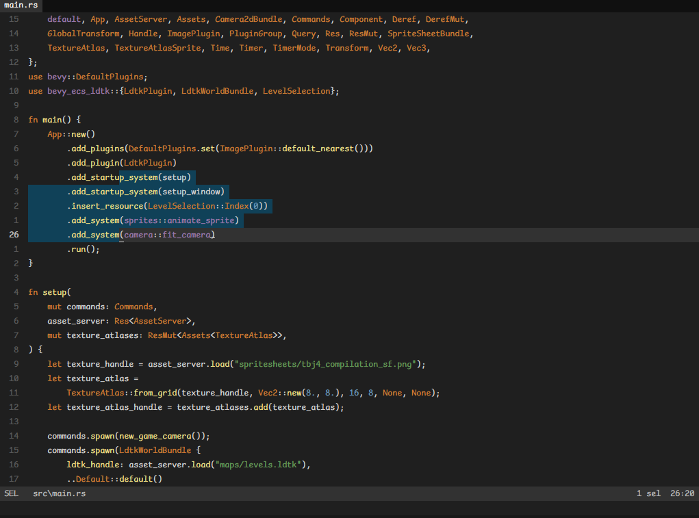
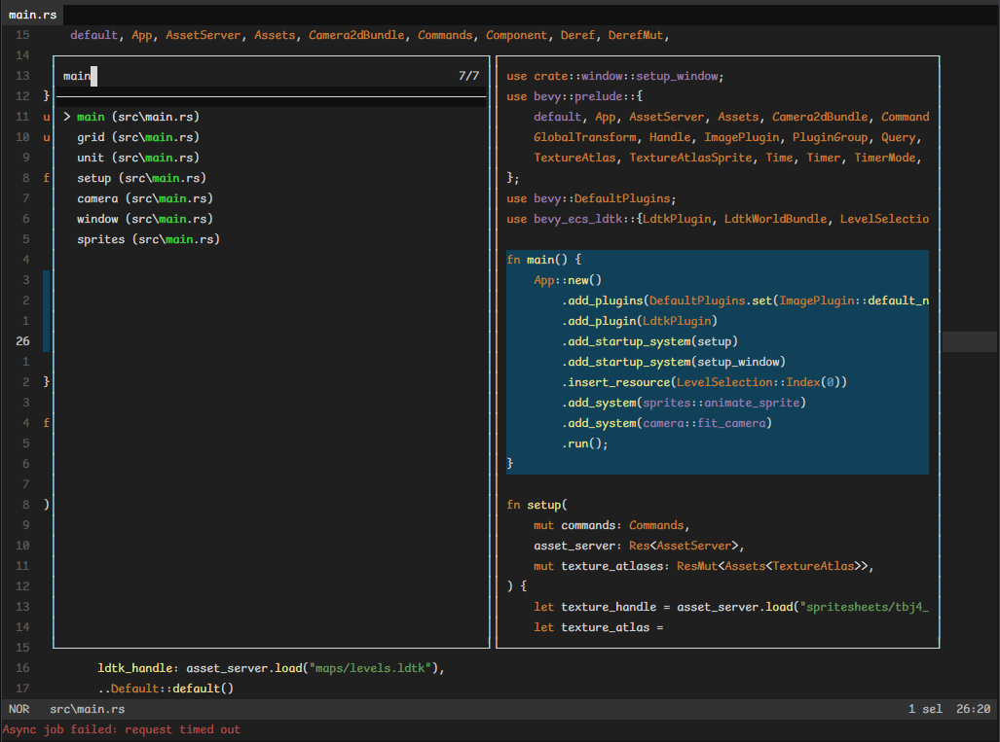

# Darcula Solid for Helix
A dark, comfortable to the eyes with good contrast for the [Helix](https://github.com/helix-editor/helix) editor.

## Screenshots

## Credits
- Colors freely and loosely based on the original Darcula Solid: https://github.com/vecheslav/darcula-solid
- Base code is the original Darcula for Helix: https://github.com/helix-editor/helix/blob/master/runtime/themes/darcula.toml
